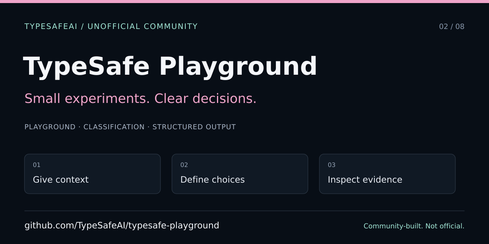

# TypeSafe Playground — developer and agent entry point

> Unofficial community project, not an official TypeSafe AI product. The TypeSafeAI community was created by VC Moderator [@BunsDev](https://github.com/BunsDev). Preserve [@nickthompson480's original playground credit](https://github.com/nickthompson480/typesafe-ai-playground), the MIT license, and asset/font notices.



[Full README](../../README.md) · [Agent instructions](../../AGENTS.md) · [Contributing](../../CONTRIBUTING.md) · [Live playground](https://jev.works)

## Start offline

Use Node.js 22+ and the exact pnpm version in `package.json`. Install with `pnpm install --frozen-lockfile`; do not switch package managers or loosen the lockfile. Run `pnpm dev` and open the printed address (normally port 3042). No key is required to browse examples or use documented local/mock paths. Live Jev evaluations are explicit, separately configured operations.

Keep personal credentials out of screenshots, URLs, exports, client bundles, and fixtures. A user-supplied browser key is distinct from a server key; localStorage is not an encrypted secret store. Read [deployment guidance](../deployment.md) before exposing a shared server key.

## Find the right contract

| Goal | Read |
| --- | --- |
| Extract exact source candidates | [Document extraction](../document-extraction.md) |
| Inspect proposal evidence | [Proposal review](../proposal-review.md) |
| Inspect public diff classification | [PR review](../pr-review.md) |
| Separate governance simulation from real checks | [AST governance](../ast-governance.md) |
| Compare classification with actual solver results | [SMT solver](../smt-solver.md) |
| Route among closed choices | [Tool router](../tool-router.md) |
| Use the real adapter without downstream execution | [LangChain](../langchain.md) |
| Compare reranking evidence and failures | [Reranker](../reranker.md) |

`app/` owns routes and server boundaries; `components/` owns interfaces; `lib/`, `types/`, and `src/extraction/` hold contracts and logic. `web/catalog.json` is the canonical pack-based catalog; portable browser exports use a different shape. Preserve the legacy `web/`, `server.py`, and `run.py` implementation and its tests.

A typed answer is not correctness or execution authorization. Keep simulated, live, solver-verified, failed, and unavailable outcomes distinct. Never fabricate metrics for an incomplete run or silently replace provider failures with mock success.

## Verify changes

```sh
pnpm test
pnpm typecheck
pnpm build
pnpm test:e2e
python3 -m unittest discover -s tests -v
```

There is no root lint script. Follow CONTRIBUTING.md for additional legacy syntax checks when touching shared web/Python code. Existing browser tests use mocked providers. The new sharing source test runs through `pnpm test`; the browser test validates rendered metadata and image retrieval against the tested build.

## Sharing and screenshots

Root sharing defaults use the confirmed public `https://jev.works` origin and the existing `public/og.png`; this change does not add a competing generator or overwrite that artwork. Child routes retain their own metadata. No root-level canonical forces all routes to the homepage.

The SVG in this guide is separate editable repository artwork, not a product screenshot. Follow the [shared publishing checklist](https://github.com/TypeSafeAI/.github/blob/main/docs/discovery/SHARING.md) and [screenshot protocol](https://github.com/TypeSafeAI/.github/blob/main/docs/discovery/SCREENSHOTS.md). Use synthetic data, record the source commit and viewport, and leave mock/live labels visible. The browse-only sharing test captures the actual home screen without starting a model evaluation. Captures are test evidence only after the run succeeds; they are not production screenshots.

Committing intended About/topics metadata does not apply GitHub settings. Preserve attribution and accurate feature descriptions rather than adding unsupported trend keywords, safety guarantees, or benchmark claims.
